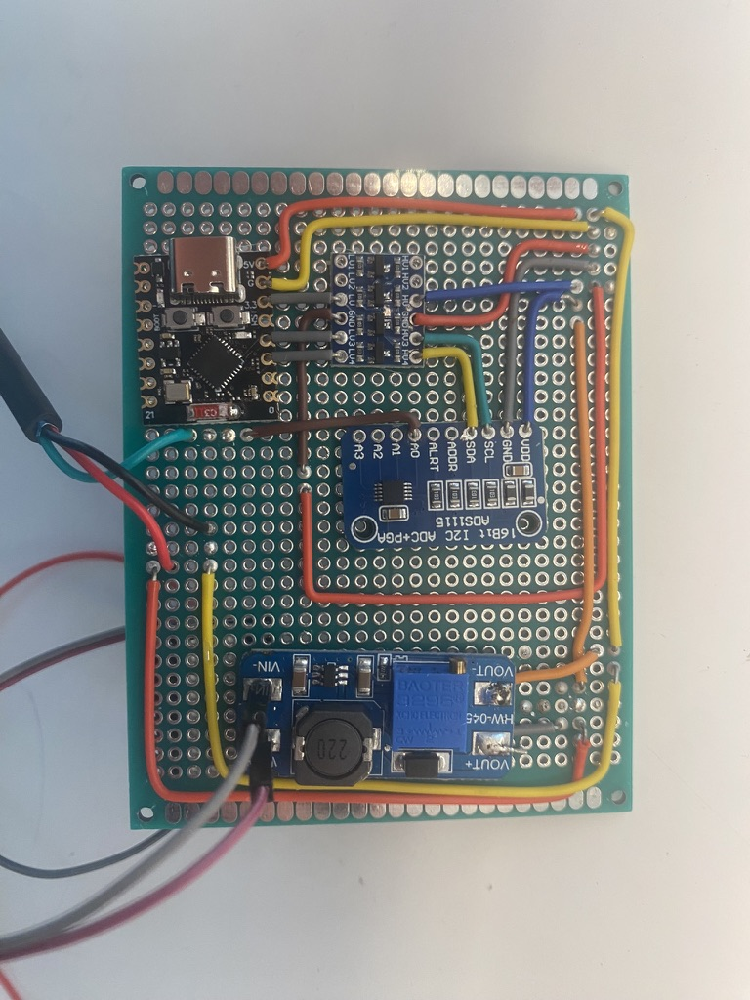
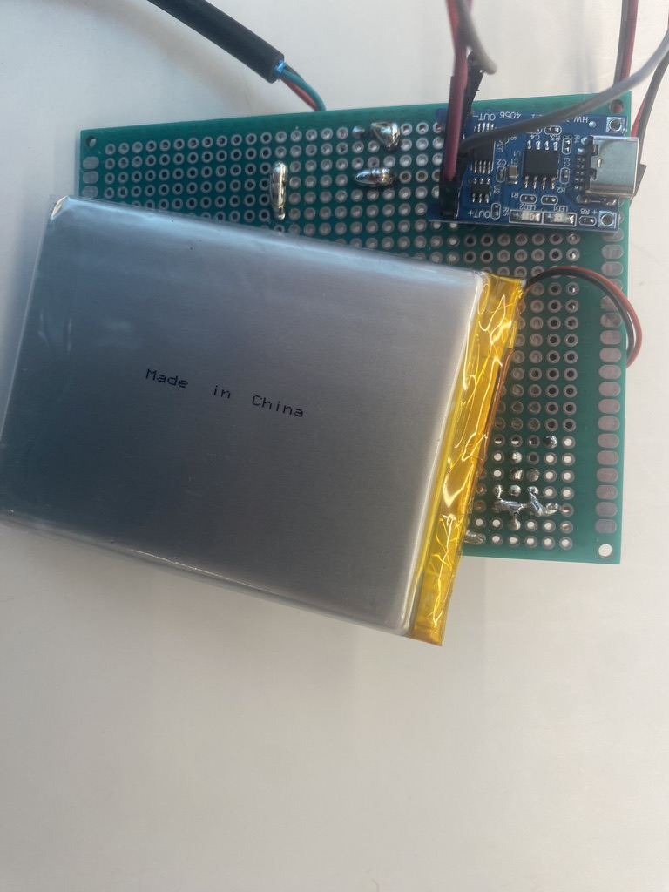

# Soldering components

Please keep in mind, this is not a tutorial that teaches you how to solder. This tutorial only shows you how to connect the wires for this specific project. Please learn to solder before.

## Overview

In this overview you can see how i made the connections, the simplest way would be if you one to one replicate this perfboard prototype but look carefully, every connection needs to be exactly the same.
Optionally you can create your own layout but then you should know what you are doing.

## What parts is it made of

SyncSip is a system that right now consists of some hardware and software. The hardware parts are a scale and a pressure sensor. As a scale i chose to integrate the Bookoo Themis mini but more scales will follow.
The pressure sensor is DIY and i have included tutorials of how to build it.

If you equip your espresso machine with the pressure sensor you can start using the product. The data is being visualized in a mobile app that you can find for free in the app and play store.

## What is the building process like ? 

The only think that you really have to build is the pressure sensor, it requires soldering and optionally 3d printing. The 3D printied structures are so simple that if you don't have access to a printer you can consider building the case in an alternative way.

So you would order the parts from the Bills of Materials and start soldering them together as shown in the tutorial. After that you can flash the microcontroller with the software and start connecting to the sensor from the Synsip App.

The building process can easily be done in a day and all you need is very basic soldering knowledge that you can learn from Youtube tutorials as i did.

## Two paths

There are essentially two ways you can use these docs, one way is to simply replicate the project and the other way is to truly understand the project and potentially make changes by yourself if you see room for improvement.
I have called these different parts the **User-Docs** and **Contributor-Docs**.
